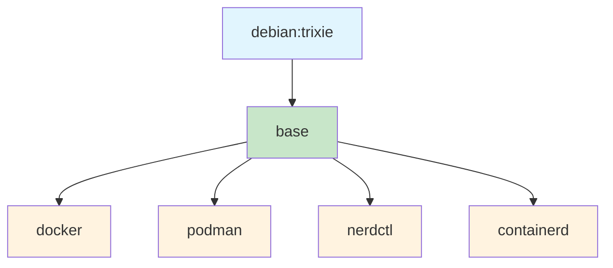

# Netshoot: Network Troubleshooting Swiss Army Knife

[](https://hub.docker.com/r/obeoneorg/netshoot)
[](https://github.com/obeone/netshoot)
[](https://github.com/obeone/netshoot/blob/main/LICENSE)

**Netshoot** is a comprehensive Docker image packed with
70+ networking and system tools for troubleshooting,
analysis, and debugging. Built on **Debian 13 Trixie**
with an enhanced Zsh shell, it's your go-to toolkit for
network diagnostics in containerized environments.

## Table of Contents

- [Origin](#origin)
- [Architecture](#architecture)
- [Features](#features)
- [Quick Start](#quick-start)
- [Common Use Cases](#common-use-cases)
- [Image Variants](#image-variants)
- [Included Tools](#included-tools)
- [Advanced Usage](#advanced-usage)
- [Building from Source](#building-from-source)
- [Contributing](#contributing)
- [CI/CD](#cicd)
- [License](#license)
- [Credits](#credits)
- [Related Projects](#related-projects)

## Origin

This project is heavily inspired by
[nicolaka/netshoot](https://github.com/nicolaka/netshoot),
a brilliant Alpine-based network troubleshooting
container. I love the concept, but I kept running into
cases where I needed tools it didn't ship: a Debian
base for broader package compatibility, `termshark`
for interactive packet inspection, `btop`, `grpcurl`,
`speedtest`, and container runtime variants (Docker,
Podman, nerdctl, containerd) for working across
different environments. So I built my own.

## Architecture

The image uses a multi-stage Dockerfile where all
variants extend from a common `base` stage:



A separate `Dockerfile.slim` provides a minimal
variant with a reduced toolset.

## Features

| Feature | Description |
| --- | --- |
| 70+ Tools | Networking, system diagnostics, container management |
| Enhanced Shell | Zsh with Oh My Zsh, Powerlevel10k, auto-suggestions, syntax highlighting |
| Multiple Variants | Base, Docker, Podman, nerdctl, containerd, slim |
| Python Ready | Python 3, pip, and uv for scripting and automation |
| Multi-Platform | AMD64 and ARM64 architectures |
| Secure Base | Debian 13 Trixie stable with regular updates |

## Quick Start

Pull and run the base image:

```bash
docker pull obeoneorg/netshoot:latest
docker run -it --rm obeoneorg/netshoot
```

Use with host networking for full network access:

```bash
docker run -it --rm --network=host obeoneorg/netshoot
```

Debug a specific container's network namespace:

```bash
# Get container PID
docker inspect -f '{{.State.Pid}}' <container-name>

# Enter the network namespace
docker run -it --rm \
  --network=container:<container-name> \
  obeoneorg/netshoot
```

## Common Use Cases

### Kubernetes Pod Debugging

```bash
# Run as a sidecar for debugging
kubectl run netshoot --rm -it \
  --image=obeoneorg/netshoot

# Debug a specific pod's network
kubectl run netshoot --rm -it \
  --image=obeoneorg/netshoot \
  --overrides='{
    "spec": {
      "hostNetwork": true,
      "containers": [{
        "name": "netshoot",
        "image": "obeoneorg/netshoot",
        "stdin": true,
        "tty": true
      }]
    }
  }'
```

### Network Performance Testing

```bash
# Start iperf3 server
docker run -it --rm -p 5201:5201 \
  obeoneorg/netshoot iperf3 -s

# Run client test from another container
docker run -it --rm \
  obeoneorg/netshoot iperf3 -c <server-ip>
```

### Traffic Analysis

```bash
# Capture packets on specific interface
docker run -it --rm --network=host \
  obeoneorg/netshoot \
  tcpdump -i eth0 -w /tmp/capture.pcap

# Analyze HTTP traffic
docker run -it --rm --network=host \
  obeoneorg/netshoot \
  ngrep -q -W byline "GET|POST" tcp port 80

# Stream live traffic to local Wireshark
docker run -i --rm --network=host \
  obeoneorg/netshoot \
  tcpdump -i eth0 -U -w - | wireshark -k -i -
```

### DNS Troubleshooting

```bash
# Comprehensive DNS query
docker run -it --rm \
  obeoneorg/netshoot dig +trace example.com

# Check DNS propagation
docker run -it --rm \
  obeoneorg/netshoot dig @8.8.8.8 example.com
```

## Image Variants

Choose the variant that matches your container
runtime needs:

| Variant | Tags | Use Case |
| --- | --- | --- |
| **Base** | `latest` | Network troubleshooting without container runtime |
| **Docker** | `docker` | Docker-in-Docker scenarios, CI/CD pipelines |
| **Podman** | `podman` | Rootless container management and testing |
| **nerdctl** | `nerdctl` | nerdctl client for existing container runtimes |
| **containerd** | `containerd` | Full containerd stack with nerdctl |
| **Slim** | `slim` | Minimal toolset for constrained environments |

### Pulling Specific Variants

```bash
# Base image (recommended for most use cases)
docker pull obeoneorg/netshoot:latest

# Docker variant for CI/CD
docker pull obeoneorg/netshoot:docker

# Slim variant for minimal footprint
docker pull obeoneorg/netshoot:slim
```

## Included Tools

Netshoot includes 70+ carefully selected tools
organized by category:

### Network Analysis and Diagnostics

| Category | Tools |
| --- | --- |
| Protocol Analysis | tcpdump, tshark, termshark, ngrep |
| Traffic Testing | iperf, iperf3, netperf, mtr, fping |
| Bandwidth Monitoring | bmon, nload, iftop |
| DNS | dig, host, nslookup (bind9-utils), dnsutils |
| Network Scanning | nmap, masscan, arp-scan, netcat-openbsd |
| Packet Crafting | hping3, arping |
| Routing / Firewalls | iptables, nftables, ipset, ipvsadm |
| Interface Management | iproute2 (ip, ss), net-tools (ifconfig, netstat), ethtool, bridge-utils |
| Connection Tracking | conntrack |

### Network Utilities

| Category | Tools |
| --- | --- |
| HTTP/HTTPS | curl, wget, httpie, apache2-utils (ab) |
| Remote Access | openssh-client, telnet |
| Data Transfer | socat, rsync, magic-wormhole |
| VPN | wireguard-tools |
| SMTP Testing | swaks |
| Performance Testing | speedtest (Ookla official CLI) |
| Other | traceroute, tcptraceroute, whois |

### System and Monitoring Tools

| Category | Tools |
| --- | --- |
| Process Monitoring | htop, btop, top (procps) |
| Resource Analysis | iotop, dstat, sysstat (sar, iostat), strace |
| Disk | ncdu, lsof |
| File Operations | rsync, unzip, zip, file |
| Text Processing | jq, vim |
| Command Correction | thefuck |
| Process Provenance | witr (why is this process, port or container running) |

### Development and Scripting

| Category | Tools |
| --- | --- |
| Python | python3, pip, uv (fast package manager) |
| Version Control | git |
| API Testing | grpcurl (gRPC) |
| Utilities | fzf (fuzzy finder), coreutils, util-linux |

### Enhanced Shell Experience

| Category | Tools |
| --- | --- |
| Zsh Framework | oh-my-zsh with custom configuration |
| Theme | powerlevel10k (modern, informative prompt) |
| Plugins | zsh-autosuggestions, zsh-completions, fast-syntax-highlighting |
| Multiplexer | tmux |

> **Note:** The default prompt uses plain Unicode and
> works in any terminal. If you have a
> [Nerd Font](https://www.nerdfonts.com/) installed,
> set `NETSHOOT_NERDFONT=1` to enable powerline
> separators and richer icons (see
> [Nerd Font prompt](#nerd-font-prompt) below).

### Security and Authentication

| Category | Tools |
| --- | --- |
| TLS/SSL | openssl, ca-certificates, check-tls |
| Access Control | sudo |
| Storage | NFS support (nfs-common) |

<details>
<summary>View complete package list</summary>

**Networking**: apache2-utils, arping, arp-scan,
bind9-utils, bmon, bridge-utils, conntrack, curl,
dnsutils, ethtool, fping, hping3, httpie, iftop,
iperf, iperf3, iproute2, ipset, iptables,
iputils-ping, ipvsadm, masscan, mtr,
netcat-openbsd, net-tools, netperf, nftables, ngrep,
nload, nmap, openssh-client, socat, speedtest, swaks,
tcpdump, tcptraceroute, telnet, termshark, tshark,
traceroute, wget, whois, wireguard-tools

**System**: bash, btop, ca-certificates, check-tls,
coreutils, dstat, file, fzf, git, grpcurl, htop,
iotop, jq, kitty-terminfo, lsof, magic-wormhole,
ncdu, nfs-common, openssl, procps, python3-pip,
rsync, strace, sudo, sysstat, thefuck, tmux, unzip,
util-linux, uv, vim, witr, zip, zsh

**Shell**: oh-my-zsh, powerlevel10k,
zsh-autosuggestions, zsh-completions,
fast-syntax-highlighting

</details>

## Advanced Usage

### Nerd Font Prompt

The default prompt uses plain Unicode characters that
work in any terminal. If you have a
[Nerd Font](https://www.nerdfonts.com/) installed on
your terminal, enable the enhanced prompt with
powerline separators and richer icons:

```bash
docker run -it --rm \
  -e NETSHOOT_NERDFONT=1 \
  obeoneorg/netshoot
```

### Custom Shell Configuration

Mount your own configuration files to customize
the environment:

```bash
# Custom Zsh configuration
docker run -it --rm \
  -v ~/.zshrc:/root/.zshrc \
  -v ~/.p10k.zsh:/root/.p10k.zsh \
  obeoneorg/netshoot

# Custom aliases and scripts
docker run -it --rm \
  -v ~/my-scripts:/scripts \
  obeoneorg/netshoot
```

### Kubernetes Deployment as DaemonSet

Deploy netshoot on all nodes for cluster-wide
troubleshooting:

```yaml
apiVersion: apps/v1
kind: DaemonSet
metadata:
  name: netshoot
spec:
  selector:
    matchLabels:
      app: netshoot
  template:
    metadata:
      labels:
        app: netshoot
    spec:
      hostNetwork: true
      containers:
      - name: netshoot
        image: obeoneorg/netshoot:latest
        command: ["/bin/sleep", "infinity"]
        securityContext:
          privileged: true
```

### File Transfer with transfer.sh

The included transfer.sh script makes sharing
files easy:

```bash
# Upload a file
docker run -it --rm \
  -v /path/to/file:/data/file \
  obeoneorg/netshoot transfer.sh /data/file

# Download with expiration
docker run -it --rm obeoneorg/netshoot \
  transfer.sh --max-days 7 myfile.txt
```

### Running as Non-Root

For production environments, run with reduced
privileges:

```bash
docker run -it --rm \
  --user 1000:1000 \
  --cap-drop=ALL \
  --cap-add=NET_RAW \
  --cap-add=NET_ADMIN \
  obeoneorg/netshoot
```

### Persistent Shell History

Keep your command history between sessions:

```bash
docker run -it --rm \
  -v netshoot-history:/root/.zsh_history \
  obeoneorg/netshoot
```

## Building from Source

### Quick Build

```bash
git clone https://github.com/obeone/netshoot.git
cd netshoot
docker build -t my-netshoot .
```

### Build Specific Variant

```bash
# Build with Docker runtime
docker build --target docker \
  -t my-netshoot:docker .

# Build with Podman runtime
docker build --target podman \
  -t my-netshoot:podman .

# Build slim variant
docker build -f Dockerfile.slim \
  -t my-netshoot:slim .
```

### Multi-Platform Build

Use the provided build script for official
multi-platform builds:

```bash
# Build all variants for AMD64 and ARM64
./build.sh

# Build specific type
./build.sh --type=debian --target=base

# Build without registry cache
./build.sh --no-cache
```

See [CLAUDE.md](CLAUDE.md) for detailed build system
documentation.

## Contributing

Contributions are welcome! Here's how you can help:

- **Report bugs**: Open an issue with details about
  the problem
- **Suggest tools**: Propose new utilities that would
  benefit network troubleshooting
- **Improve documentation**: Fix typos, add examples,
  or clarify instructions
- **Submit pull requests**: Follow conventional commit
  format for your changes

Check out [CLAUDE.md](CLAUDE.md) for development
guidelines and architecture details.

## CI/CD

Docker images are published via GitHub Actions to:

- **GHCR**: `ghcr.io/obeone/netshoot`
- **Docker Hub**: `obeoneorg/netshoot`

Pushes to `main` publish floating tags. Semantic
version tags (`v*.*.*`) publish versioned tags per
variant. Pull requests trigger build-only validation
(no push).

## License

This project is licensed under the **MIT License**.
See the [LICENSE](LICENSE) file for details.

## Credits

Built by
[Gregoire Compagnon (obeone)](https://github.com/obeone)

Special thanks to:

- [Nicolas Kabar (nicolaka)](https://github.com/nicolaka)
  for the original
  [netshoot](https://github.com/nicolaka/netshoot)
  that started it all
- The Debian Project for the solid foundation
- Oh My Zsh and Powerlevel10k communities
- All the maintainers of the included open-source
  tools

## Related Projects

- [nicolaka/netshoot](https://github.com/nicolaka/netshoot) -
  The original Alpine-based network troubleshooting
  container
- [docker/cli](https://github.com/docker/cli) -
  Docker CLI
- [containers/podman](https://github.com/containers/podman) -
  Podman container engine
- [containerd/nerdctl](https://github.com/containerd/nerdctl) -
  Docker-compatible CLI for containerd
