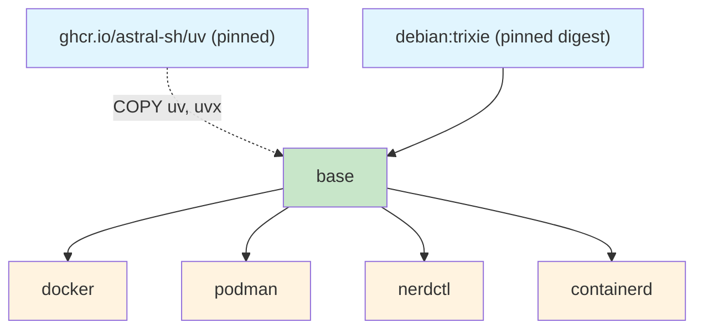

# Netshoot: Network Troubleshooting Swiss Army Knife

[](https://hub.docker.com/r/obeoneorg/netshoot)
[](https://github.com/obeone/netshoot)
[](https://github.com/obeone/netshoot/blob/main/LICENSE)

**Netshoot** is a comprehensive Docker image packed with
70+ networking and system tools for troubleshooting,
analysis, and debugging. Built on **Debian 13 Trixie**
with an enhanced Zsh shell, it's your go-to toolkit for
network diagnostics in containerized environments.

## Table of Contents

- [Origin](#origin)
- [Architecture](#architecture)
- [Features](#features)
- [Quick Start](#quick-start)
- [Common Use Cases](#common-use-cases)
- [Image Variants](#image-variants)
- [Included Tools](#included-tools)
- [Advanced Usage](#advanced-usage)
- [Building from Source](#building-from-source)
- [Contributing](#contributing)
- [CI/CD](#cicd)
- [License](#license)
- [Credits](#credits)
- [Related Projects](#related-projects)

## Origin

This project is heavily inspired by
[nicolaka/netshoot](https://github.com/nicolaka/netshoot),
a brilliant Alpine-based network troubleshooting
container. I love the concept, but I kept running into
cases where I needed tools it didn't ship: a Debian
base for broader package compatibility, `termshark`
for interactive packet inspection, `btop`, `grpcurl`,
`speedtest`, and container runtime variants (Docker,
Podman, nerdctl, containerd) for working across
different environments. So I built my own.

## Architecture

The image uses a multi-stage Dockerfile where all
variants extend from a common `base` stage:


```mermaid
flowchart TB
    U["ghcr.io/astral-sh/uv (pinned)"] -. "COPY uv, uvx" .-> B
    A["debian:trixie (pinned digest)"] --> B["base"]
    B --> C["docker"]
    B --> D["podman"]
    B --> E["nerdctl"]
    B --> F["containerd"]

    style U fill:#e1f5fe
    style A fill:#e1f5fe
    style B fill:#c8e6c9
    style C fill:#fff3e0
    style D fill:#fff3e0
    style E fill:#fff3e0
    style F fill:#fff3e0
```

A separate `Dockerfile.slim` provides a minimal
variant with a reduced toolset.

Both the Debian base image and the `uv` image are
pinned by digest (Dependabot bumps them), and the
Oh My Zsh, plugin and Powerlevel10k checkouts are
pinned to exact commits. The images are still rebuilt
every week so that Debian security updates land
without waiting for a release.

## Features

| Feature | Description |
| --- | --- |
| 70+ Tools | Networking, system diagnostics, container management |
| Enhanced Shell | Zsh with Oh My Zsh, Powerlevel10k, auto-suggestions, syntax highlighting, for root or any uid |
| Multiple Variants | Base, Docker CLI, Podman, nerdctl, containerd, slim |
| Python Ready | Python 3 with venv, and uv for scripting and automation |
| Multi-Platform | AMD64 and ARM64 architectures |
| Secure Base | Debian 13 Trixie stable, pinned by digest, rebuilt weekly for security updates |
| Supply Chain | Checksum-verified downloads where upstream publishes checksums, cosign signatures, SBOM and provenance attestations |

## Quick Start

Pull and run the base image:

```bash
docker pull obeoneorg/netshoot:latest
docker run -it --rm obeoneorg/netshoot
```

Use with host networking for full network access:

```bash
docker run -it --rm --network=host obeoneorg/netshoot
```

Debug a specific container's network namespace:

```bash
# Get container PID
docker inspect -f '{{.State.Pid}}' <container-name>

# Enter the network namespace
docker run -it --rm \
  --network=container:<container-name> \
  obeoneorg/netshoot
```

## Common Use Cases

### Kubernetes Pod Debugging

```bash
# Run as a sidecar for debugging
kubectl run netshoot --rm -it \
  --image=obeoneorg/netshoot

# Debug a specific pod's network
kubectl run netshoot --rm -it \
  --image=obeoneorg/netshoot \
  --overrides='{
    "spec": {
      "hostNetwork": true,
      "containers": [{
        "name": "netshoot",
        "image": "obeoneorg/netshoot",
        "stdin": true,
        "tty": true
      }]
    }
  }'
```

### Network Performance Testing

```bash
# Start iperf3 server
docker run -it --rm -p 5201:5201 \
  obeoneorg/netshoot iperf3 -s

# Run client test from another container
docker run -it --rm \
  obeoneorg/netshoot iperf3 -c <server-ip>
```

### Traffic Analysis

```bash
# Capture packets on specific interface
docker run -it --rm --network=host \
  obeoneorg/netshoot \
  tcpdump -i eth0 -w /tmp/capture.pcap

# Analyze HTTP traffic
docker run -it --rm --network=host \
  obeoneorg/netshoot \
  ngrep -q -W byline "GET|POST" tcp port 80

# Stream live traffic to local Wireshark
docker run -i --rm --network=host \
  obeoneorg/netshoot \
  tcpdump -i eth0 -U -w - | wireshark -k -i -
```

### DNS Troubleshooting

```bash
# Comprehensive DNS query
docker run -it --rm \
  obeoneorg/netshoot dig +trace example.com

# Check DNS propagation
docker run -it --rm \
  obeoneorg/netshoot dig @8.8.8.8 example.com
```

## Image Variants

Choose the variant that matches your container
runtime needs:

| Variant | Tags | Use Case |
| --- | --- | --- |
| **Base** | `latest` | Network troubleshooting without container runtime |
| **Docker** | `docker` | Docker CLI, buildx and compose, driving the host engine through its mounted socket (no daemon inside) |
| **Podman** | `podman` | Rootless container management and testing |
| **nerdctl** | `nerdctl` | nerdctl client for existing container runtimes |
| **containerd** | `containerd` | Full containerd stack with nerdctl |
| **Slim** | `slim` | Minimal toolset for constrained environments |

The `docker` variant ships the client only
(`docker-ce-cli`, `docker-buildx-plugin`,
`docker-compose-plugin`): there is no `dockerd` or
`containerd` in the image. Mount the socket of the
engine you want to talk to.

### Pulling Specific Variants

```bash
# Base image (recommended for most use cases)
docker pull obeoneorg/netshoot:latest

# Docker variant (CLI only): talk to the host engine
docker run -it --rm \
  -v /var/run/docker.sock:/var/run/docker.sock \
  obeoneorg/netshoot:docker

# Slim variant for minimal footprint
docker pull obeoneorg/netshoot:slim
```

## Included Tools

Netshoot includes 70+ carefully selected tools
organized by category:

### Network Analysis and Diagnostics

| Category | Tools |
| --- | --- |
| Protocol Analysis | tcpdump, tshark, termshark, ngrep, tcpflow (TCP stream reassembly) |
| DHCP | dhcpdump |
| Traffic Testing | iperf, iperf3, netperf, mtr, fping |
| Bandwidth Monitoring | bmon, nload, iftop, nethogs (per process) |
| DNS | dig, host, nslookup (bind9-dnsutils), doggo |
| Network Scanning | nmap, masscan, arp-scan, netcat-openbsd |
| TLS Scanning | sslscan |
| Packet Crafting | hping3, arping |
| Routing / Firewalls | iptables, nftables, ipset, ipvsadm |
| Interface Management | iproute2 (ip, ss), net-tools (ifconfig, netstat), ethtool, bridge-utils |
| Addressing | sipcalc (IPv4/IPv6 subnet calculator) |
| Connection Tracking | conntrack |

### Network Utilities

| Category | Tools |
| --- | --- |
| HTTP/HTTPS | curl, wget, httpie, apache2-utils (ab) |
| WebSocket | websocat |
| Remote Access | openssh-client, telnet |
| Data Transfer | socat, rsync, magic-wormhole |
| VPN | wireguard-tools |
| SMTP Testing | swaks |
| LDAP | ldap-utils (ldapsearch, ldapwhoami, ...) |
| SNMP | snmp (snmpwalk, snmpget, ...) |
| Performance Testing | speedtest (Ookla official CLI) |
| Path Discovery | traceroute, tcptraceroute, tracepath (iputils-tracepath) |
| Other | whois |

### System and Monitoring Tools

| Category | Tools |
| --- | --- |
| Process Monitoring | htop, btop, top (procps) |
| Resource Analysis | iotop, sysstat (sar, iostat), strace |
| Disk | ncdu, lsof |
| File Operations | rsync, unzip, zip, file |
| Text Processing | jq, vim, less |
| Documentation | man (man-db, with the packages' man pages) |
| Command Correction | thefuck |
| Process Provenance | witr (why is this process, port or container running) |

### Development and Scripting

| Category | Tools |
| --- | --- |
| Python | python3 with venv, uv (fast package manager) |
| Version Control | git |
| API Testing | grpcurl (gRPC) |
| Kubernetes | kubectl (upstream stable release) |
| Utilities | fzf (fuzzy finder), coreutils, util-linux |

### Enhanced Shell Experience

| Category | Tools |
| --- | --- |
| Zsh Framework | oh-my-zsh with custom configuration |
| Theme | powerlevel10k (modern, informative prompt) |
| Plugins | zsh-autosuggestions, zsh-completions, fast-syntax-highlighting |
| Multiplexer | tmux |

### Security and Authentication

| Category | Tools |
| --- | --- |
| TLS/SSL | openssl, ca-certificates, check-tls, sslscan |
| Signatures | gnupg |

`python3-pip` is no longer installed explicitly: Debian's
Python is [externally managed](https://peps.python.org/pep-0668/),
so a system-wide `pip install` is refused anyway. Use
`python3 -m venv` or `uv` instead. (`pip` itself is still
present, pulled in as a dependency of `httpie` and
`python3-venv`.) `sudo`, `dstat` and `nfs-common` were
removed. `bind9-utils` was replaced by
`bind9-dnsutils` in both the full and the slim image
(it is the package that ships dig, host and nslookup),
so the BIND admin tools it carried (`dnssec-*`,
`named-checkconf`, `named-checkzone`,
`named-compilezone`, `tsig-keygen`...) are gone.

<details>
<summary>View complete package list</summary>

**Networking**: apache2-utils, arping, arp-scan,
bind9-dnsutils, bmon, bridge-utils, conntrack, curl,
dhcpdump, ethtool, fping, hping3, httpie, iftop,
iperf, iperf3, iproute2, ipset, iptables,
iputils-ping, iputils-tracepath, ipvsadm, ldap-utils,
masscan, mtr, netcat-openbsd, net-tools, nethogs,
netperf, nftables, ngrep, nload, nmap,
openssh-client, sipcalc, snmp, socat, speedtest,
sslscan, swaks, tcpdump, tcpflow, tcptraceroute,
telnet, termshark, tshark, traceroute, wget, whois,
wireguard-tools

**System**: bash, btop, ca-certificates, coreutils,
file, fzf, git, gnupg, htop, iotop, jq,
kitty-terminfo, less, lsof, magic-wormhole, man-db,
ncdu, openssl, procps, python3-venv, rsync, strace,
sysstat, thefuck, tmux, unzip, util-linux, vim, zip,
zsh

**Upstream releases** (not packaged, or too old, in
trixie): check-tls (via uv), doggo, grpcurl, kubectl,
uv, websocat, witr

**Shell**: oh-my-zsh, powerlevel10k,
zsh-autosuggestions, zsh-completions,
fast-syntax-highlighting

**Slim image**: apache2-utils, bash,
bind9-dnsutils, btop, ca-certificates, coreutils,
curl, ethtool, file, fping, git, httpie, iperf3,
iproute2, iputils-ping, iputils-tracepath, jq,
kitty-terminfo, less, lsof, mtr, netcat-openbsd,
net-tools, nmap, openssh-client, procps, rsync,
socat, strace, tcpdump, telnet, tmux, traceroute,
unzip, util-linux, vim, wget, whois, zip, zsh, plus
check-tls, uv, witr and the same shell setup

</details>

## Advanced Usage

### Custom Shell Configuration

The bundled Zsh configuration lives outside the home
directory: `ZDOTDIR=/etc/zsh/netshoot` holds
`.zshrc`, `.zshenv` and `.p10k.zsh`, and Oh My Zsh
with its plugins and theme is installed in
`/opt/oh-my-zsh`. Nothing shell related is kept in
`/root`, so your own files can be mounted into the
home directory (`/root` for the default user)
without hiding the bundled ones.

The recommended way to customize the shell is a
`~/.zshrc.local` file. The bundled `.zshrc` sources
it (and `~/.zshrc.secrets`, if present) after the
`plugins` array is defined and before Oh My Zsh is
loaded, so `plugins+=(...)` works and any setting can
be overridden:

```bash
# Extra aliases, plugins and settings on top of the bundled config
docker run -it --rm \
  -v ~/.zshrc.local:/root/.zshrc.local:ro \
  obeoneorg/netshoot

# Your own Powerlevel10k prompt (used instead of the bundled one)
docker run -it --rm \
  -v ~/.p10k.zsh:/root/.p10k.zsh:ro \
  obeoneorg/netshoot

# Custom scripts
docker run -it --rm \
  -v ~/my-scripts:/scripts \
  obeoneorg/netshoot
```

Mounting a full `~/.zshrc` replaces the bundled
configuration: when `~/.zshrc` exists, the bundled
file sources it and stops there, and none of the
bundled settings apply.

```bash
docker run -it --rm \
  -v ~/.zshrc:/root/.zshrc:ro \
  obeoneorg/netshoot
```

Things to know when you bring your own `~/.zshrc`:

- Oh My Zsh moved from `/root/.oh-my-zsh` to
  `/opt/oh-my-zsh`. A file built from the stock Oh My
  Zsh template sets `export ZSH="$HOME/.oh-my-zsh"`,
  which no longer exists: set
  `export ZSH=/opt/oh-my-zsh` instead. The bundled
  plugins and Powerlevel10k are under
  `/opt/oh-my-zsh/custom`.
- `ZDOTDIR` stays set to `/etc/zsh/netshoot`. The
  files there forward to your `~/.zshenv`,
  `~/.zprofile`, `~/.zlogin` and `~/.zlogout` when
  they exist, but anything in your config that uses
  `${ZDOTDIR:-$HOME}` (a compinit dump, zim, antidote,
  `p10k configure` output...) points to
  `/etc/zsh/netshoot`. Pass `-e ZDOTDIR=/root` (your
  home directory) to use a plain home-directory layout
  with your own files only.

### Kubernetes Deployment as DaemonSet

Deploy netshoot on all nodes for cluster-wide
troubleshooting:

```yaml
apiVersion: apps/v1
kind: DaemonSet
metadata:
  name: netshoot
spec:
  selector:
    matchLabels:
      app: netshoot
  template:
    metadata:
      labels:
        app: netshoot
    spec:
      hostNetwork: true
      containers:
      - name: netshoot
        image: obeoneorg/netshoot:latest
        command: ["/bin/sleep", "infinity"]
        securityContext:
          privileged: true
```

### File Transfer with transfer.sh

The included transfer.sh script makes sharing
files easy:

```bash
# Upload a file
docker run -it --rm \
  -v /path/to/file:/data/file \
  obeoneorg/netshoot transfer.sh send /data/file

# Upload with expiration (kept for 7 days)
docker run -it --rm \
  -v /path/to/file:/data/file \
  obeoneorg/netshoot transfer.sh send --max-days 7 /data/file
```

Run `transfer.sh --help` for the other commands
(`receive`, `delete`, `info`).

### Running as Non-Root

The shell and every tool that needs no special
privileges work for any uid, including one without a
passwd entry (where `HOME` is `/` and not writable).
The shell configuration is world-readable, and
caches, the completion dump and the history go to
`$HOME` when it is writable, otherwise to a private
`/tmp/netshoot-<uid>` directory:

```bash
# curl, dig, doggo, grpcurl, kubectl, check-tls, ...
docker run -it --rm \
  --user 1000:1000 -w /tmp \
  obeoneorg/netshoot
```

`-w /tmp` is optional: the default working directory
is `/root`, which only root can read.

Tools that need raw sockets or network
administration (tcpdump, tshark, nmap SYN and OS
scans, arping, hping3, iptables, nft, changing links
or routes with `ip`, ...) still need root inside the
container. For a non-root user, `--cap-add` only
lands in the bounding set, not in the effective set,
so the process does not actually get the capability
unless the binary carries file capabilities, and
tcpdump, nmap, hping3, iptables and friends are
installed without any. `sudo` is not installed.

To reduce privileges for these tools, keep root in
the container but drop every capability except the
ones they need:

```bash
docker run -it --rm \
  --cap-drop=ALL \
  --cap-add=NET_RAW \
  --cap-add=NET_ADMIN \
  obeoneorg/netshoot
```

With this set, `tcpdump` cannot switch to its
unprivileged `tcpdump` user after opening the
interface (that needs `SETUID` and `SETGID`): run it
with `-Z root`, or add those two capabilities.

### Persistent Shell History

Point `HISTFILE` at a file inside a volume to keep
your command history between sessions:

```bash
docker run -it --rm \
  -e HISTFILE=/history/zsh_history \
  -v netshoot-history:/history \
  obeoneorg/netshoot
```

Mount a directory, not the history file itself: the
older `-v netshoot-history:/root/.zsh_history` form
made Docker create a directory at that path, so zsh
could not write its history. A `HISTFILE` set with
`-e` is always respected. When running as a non-root
uid, the volume must be writable by that uid (for
instance a bind mount of a directory you own).

## Building from Source

### Quick Build

```bash
git clone https://github.com/obeone/netshoot.git
cd netshoot
docker build -t my-netshoot .
```

### Build Specific Variant

```bash
# Build with the Docker CLI
docker build --target docker \
  -t my-netshoot:docker .

# Build with Podman runtime
docker build --target podman \
  -t my-netshoot:podman .

# Build slim variant
docker build -f Dockerfile.slim \
  -t my-netshoot:slim .
```

### Build Options

The Dockerfiles need BuildKit (the default builder
of current Docker releases): install scripts are
bind-mounted from `scripts/` and never copied into
the image, and downloads use cache mounts.

Tools downloaded from upstream releases default to
their latest release. Pin one with a build arg
(empty means latest):

| Build arg | Tool | Stages |
| --- | --- | --- |
| `GRPCURL_VERSION` | grpcurl | `base` (Dockerfile) |
| `WITR_VERSION` | witr | `base` (Dockerfile and Dockerfile.slim) |
| `DOGGO_VERSION` | doggo | `base` (Dockerfile) |
| `WEBSOCAT_VERSION` | websocat | `base` (Dockerfile) |
| `KUBECTL_VERSION` | kubectl (default: `stable.txt` from dl.k8s.io) | `base` (Dockerfile) |
| `NERDCTL_VERSION` | nerdctl / nerdctl-full | `nerdctl`, `containerd` |

```bash
docker build \
  --build-arg GRPCURL_VERSION=v1.9.4 \
  --build-arg KUBECTL_VERSION=v1.37.1 \
  -t my-netshoot .
```

The latest release tags are resolved through the
GitHub API when a token is available, otherwise
through the `releases/latest` redirect of
github.com (no token needed). To avoid API rate
limits, pass a token as the optional `github_token`
build secret. It is only mounted for the install
steps and never ends up in the image or its history:

```bash
GITHUB_TOKEN=$(gh auth token) docker build \
  --secret id=github_token,env=GITHUB_TOKEN \
  -t my-netshoot .
```

`CACHE_BUST` is referenced by the
`apt-get full-upgrade` step, so a new value reruns
the upgrade and every layer after it while the
earlier layers stay cached. CI and `build.sh` pass
the ISO week, which refreshes the packages once a
week:

```bash
docker build \
  --build-arg CACHE_BUST="$(date -u +%G-W%V)" \
  -t my-netshoot .
```

### Multi-Platform Build

Use the provided build script for official
multi-platform builds:

```bash
# Build all variants for AMD64 and ARM64
./build.sh

# Build specific type
./build.sh --type=debian --target=base

# Build without registry cache
./build.sh --no-cache
```

`build.sh` always passes `CACHE_BUST` (the current
ISO week unless `CACHE_BUST` is already set in the
environment), and passes `GITHUB_TOKEN` as the
`github_token` build secret when that variable is
set.

### Smoke Test

`tests/smoke.sh` checks a locally built image: the
expected binaries are present (and removed ones are
absent), the main tools run, `check-tls` and the
shell work as uid 1000, and the variant-specific
tools respond:

```bash
docker build -t my-netshoot .
bash tests/smoke.sh base my-netshoot

docker build --target docker -t my-netshoot:docker .
bash tests/smoke.sh docker my-netshoot:docker
```

The variant is one of `base`, `slim`, `docker`,
`podman`, `nerdctl` or `containerd`.

See [CLAUDE.md](CLAUDE.md) for detailed build system
documentation.

## Contributing

Contributions are welcome! Here's how you can help:

- **Report bugs**: Open an issue with details about
  the problem
- **Suggest tools**: Propose new utilities that would
  benefit network troubleshooting
- **Improve documentation**: Fix typos, add examples,
  or clarify instructions
- **Submit pull requests**: Follow conventional commit
  format for your changes, and run the smoke test for
  the variants you touched

Pull requests are checked by the lint workflow
(shellcheck, hadolint with `.hadolint.yaml`,
actionlint) and by the build workflow, which runs
the smoke test on every variant.

Check out [CLAUDE.md](CLAUDE.md) for development
guidelines and architecture details.

## CI/CD

Docker images are published via GitHub Actions to:

- **GHCR**: `ghcr.io/obeone/netshoot`
- **Docker Hub**: `obeoneorg/netshoot`

Pushes to `main` publish floating tags. Semantic
version tags (`v*.*.*`) publish versioned tags per
variant. Pull requests trigger build-only validation
(no push).

- **Weekly rebuild**: every Monday at 04:17 UTC the
  floating tags are rebuilt and republished, so they
  pick up Debian security updates even when nothing
  was merged. All builds of a run share the same
  `CACHE_BUST` value (the ISO week).
- **Smoke test gate**: each variant is first built
  for `linux/amd64`, loaded into the runner and
  checked with `tests/smoke.sh`. The multi-arch
  build and push only run if it passes, on pull
  requests too.
- **Lint**: a separate workflow runs shellcheck on
  every shell script, hadolint on both Dockerfiles
  and actionlint on the workflows.
- **Metadata**: images carry OCI labels and
  annotations (version, revision, creation date,
  license, source, per-variant title and
  description).
- **Attestations**: pushed images get a provenance
  attestation (`mode=max`) and an SBOM.
- **Signatures**: pushed images are signed with
  cosign (keyless, GitHub OIDC).

Verify a signature and inspect the attestations:

```bash
cosign verify ghcr.io/obeone/netshoot:latest \
  --certificate-identity-regexp '^https://github.com/obeone/netshoot/' \
  --certificate-oidc-issuer https://token.actions.githubusercontent.com

docker buildx imagetools inspect ghcr.io/obeone/netshoot:latest \
  --format '{{ json .SBOM }}'
docker buildx imagetools inspect ghcr.io/obeone/netshoot:latest \
  --format '{{ json .Provenance }}'
```

## License

This project is licensed under the **MIT License**.
See the [LICENSE](LICENSE) file for details.

## Credits

Built by
[Gregoire Compagnon (obeone)](https://github.com/obeone)

Special thanks to:

- [Nicolas Kabar (nicolaka)](https://github.com/nicolaka)
  for the original
  [netshoot](https://github.com/nicolaka/netshoot)
  that started it all
- The Debian Project for the solid foundation
- Oh My Zsh and Powerlevel10k communities
- All the maintainers of the included open-source
  tools

## Related Projects

- [nicolaka/netshoot](https://github.com/nicolaka/netshoot) -
  The original Alpine-based network troubleshooting
  container
- [docker/cli](https://github.com/docker/cli) -
  Docker CLI
- [containers/podman](https://github.com/containers/podman) -
  Podman container engine
- [containerd/nerdctl](https://github.com/containerd/nerdctl) -
  Docker-compatible CLI for containerd
